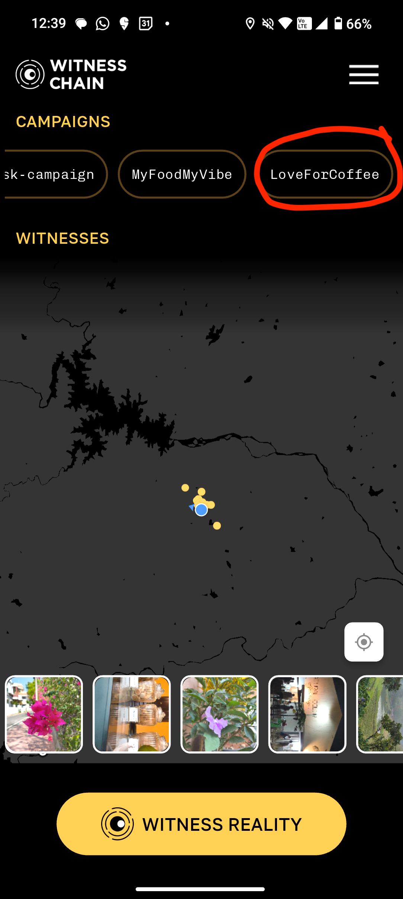
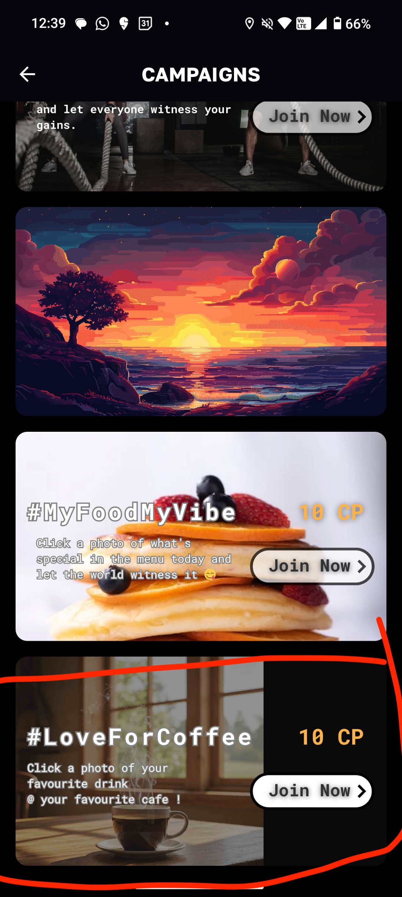

# WitnessChain API Tutorial

This repository contains a tutorial script that demonstrates how to use the WitnessChain API to create campaigns. The example shows how to set up and configure different campaign types with various parameters.

## Prerequisites

- Python 3.6+
- pip (Python package installer)

## Installation

1. Clone the repository:
```bash
git clone https://github.com/witnesschain-com/tutorials.git
cd tutorials
```

2. Install the required dependencies:
```bash
pip install -r requirements.txt
```

## Dependencies

The script requires the following Python packages:
- pytz
- datetime

## Usage

The script demonstrates how to create a basic campaign using the WitnessChain API and a JSON configuration file:

### Configuration File

Create a `campaign_config.json` file with your campaign parameters:

Given below is a sample config file for a coffee campaign

```json
{
    "campaign": "LoveForCoffee",
    "description": "Share your love for coffee by clicking your drink at your favourite cafe",
    "type": "individual",
    "tags": ["coffee", "love"],
    "latitude": 12.9,
    "longitude": 77.5,
    "radius": 100,
    "banner_url": "https://truesnap.s3.us-east-1.amazonaws.com/banner_loveforcoffee.jpg",
    "poster_url": "https://truesnap.s3.us-east-1.amazonaws.com/poster_loveforcoffee.jpg",
    "currency": "POINTS",
    "total_rewards": 10.0,
    "reward_per_submission: 2.0,
    "fuel_required": 1.0,
    "max_submissions": 10000,
    "is_active": true
}
```

### Set the Key that is whitelisted to create campaigns

```bash
export PRIVATE_KEY=<PRIVATE_KEY_WHITELISTED_TO_CREATE_CAMPAIGNS>
```

Contact us on [Discord](https://discord.gg/2n35sBfCNR) to get your key whitelisted

### Create the campaign on InfinityWatch

#### Execution 
```bash
python create_campaign.py
```

Successful creation log output should be as follows

```bash
SUCCESS https://mainnet.witnesschain.com/proof/v1/pol/pre-login
{"result":{"message":"Login to <mainnet.witnesschain.com>\n\.............."}}

SUCCESS https://mainnet.witnesschain.com/proof/v1/pol/login
{"result":{"success":true},"warning":"Your device is not secure"}

SUCCESS https://mainnet.witnesschain.com/proof/v1/pol/create-campaign
{"result":{"success":true,"campaign_id":"LoveForCoffee","action":"campaign-created"}}

```

#### Validation in InfinityWatch App

The campaigns should appear if they are successfully launched




### Obtain the feed photos for the campaign
```bash
python get-feed-from-campaign.py
```


## Script Overview

The provided script shows how to:
1. Set up timezone information
2. Load campaign configuration from a JSON file
3. Initialize the WitnessChain API
4. Authenticate with the API
5. Create a new campaign

## Campaign Types

The script demonstrates the configuration for different campaign types:
- **Individual**: For campaigns targeting individual users
- **Group**: For campaigns requiring users to be in proximity (commented examples in script)
- **Task**: For campaigns with specific tasks to complete (commented examples in script)

## Configuration Parameters

Key parameters that can be configured:
- Campaign name and description
- Geographic constraints (latitude, longitude, radius)
    - If you want to configure global tasks, you can ignore these fields. 
- Visual assets (banner and poster URLs)
- Reward structure (currency, amounts, fuel requirements)
- Time constraints (start and end dates)
- Submission limits
- Campaign activation status

## Authentication

The script handles authentication automatically through:
```python
wc_api.login()
```

## Common Errors

### Not whitelisted
```bash
FAILURE 403 https://mainnet.witnesschain.com/proof/v1/pol/create-campaign
{
        "error": {
                "message": "You are not whitelisted"
        }
}
```
You need to be whitelisted to create campaigns. Contact us on Discord to whitelist: https://discord.com/invite/2n35sBfCNR

### Images not appearing on InfinityWatch app

- Ensure you have uploaded the poster and banner images in hosting sites that can be publicly accessed.

### Campaigns not appearing on InfinityWatch app in certain locations

- Ensure the radius provided in the config file is large enough to cover the desired locations

### Invalid radius
```bash
FAILURE 400 https://mainnet.witnesschain.com/proof/v1/pol/create-campaign
{
        “error”: {
                “message”: “invalid ‘radius’”
        }
}
```
- Radius should be between 0 and 100

## Notes

- Ensure you have proper API credentials configured before running the script
- The script will automatically add timestamp information to your JSON configuration
- For group campaigns, add `"location_limit_in_meters"` and `"time_limit_in_minutes"` to your JSON
- For task campaigns, add a `"tasks"` object with your specific tasks in the JSON configuration
- You can modify the example script to read from a custom JSON file path
